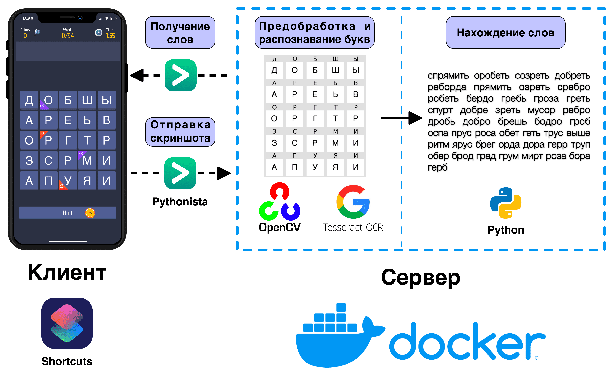
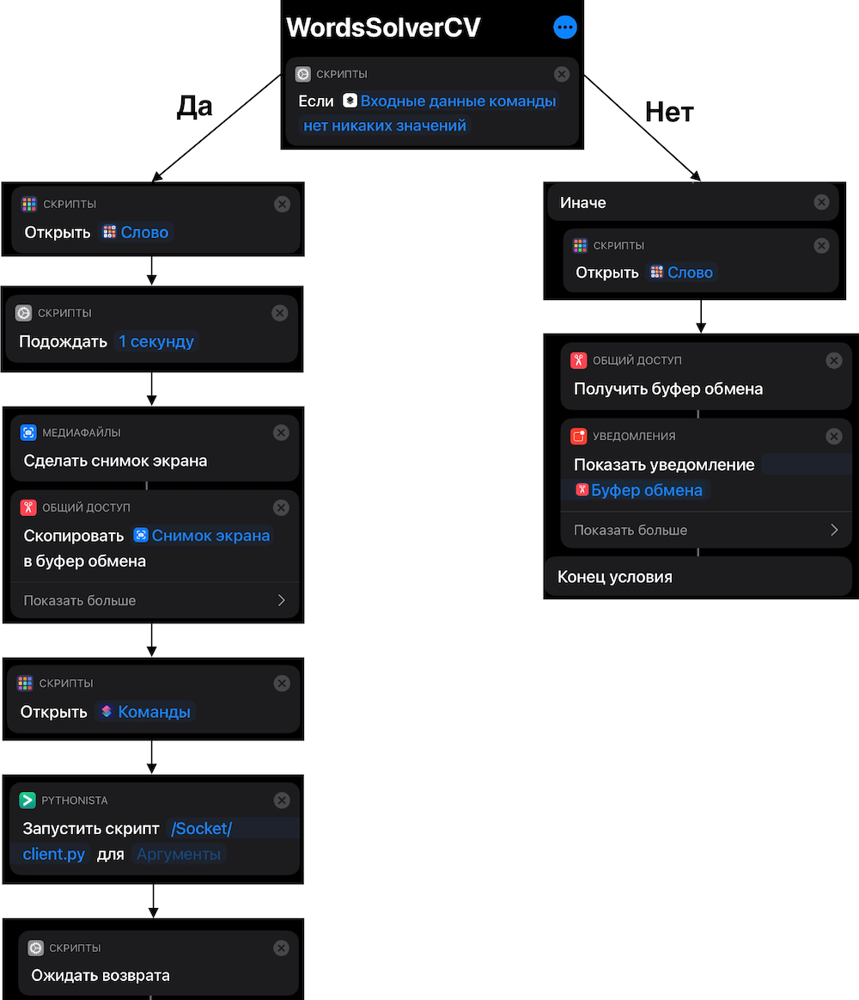

# Автоматическое распознавание букв и нахождение слов в игре "Слово"

## Описание:

Данная программа состоит из 2-х частей: клиентская  и серверная.

**Серверная часть** принимает изображение от клиента, автоматически распознает буквы на скриншоте с игрой, ищет все слова по словарю и отправляет результат клиенту.

**Клиентская часть** отправляет серверу скриншот, ждет обработку букв и нахождение слов, получает от сервера результат и показывает его в виде уведомления пользователю.

[Ссылка на статью](https://habr.com/ru/post/576820/), в которой подробно описывается работа приложения.

### Упрощенная схема работы приложения



### Пример работы


### Тестирование

Для проверки работы серверной части можно запустить файл `client_demo.py`.

Демонстрация алгоритма нахождения слов и распознавания букв приведены в папке `notebooks`, где располагаются два jupyter notebook-а.

## Установка

1. Скопируйте репозиторий проекта:

```bash
git clone https://github.com/voropaevv/words_solver_cv.git
```

2. Разверните и запустите Docker:

```bash
docker-compose up --build
```

3. Создайте Shortcut согласно схеме ниже:



4. Скопируйте код из файла `client_iphone.py` в скрипт в приложении Pythonista по пути `/Socket/client.py`
5. В скрипте `/Socket/client.py` необходимо поменять ip хоста, на котором запущен Docker.
